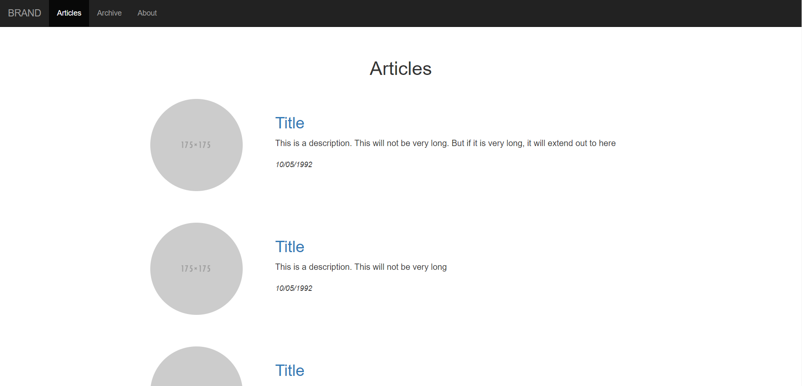
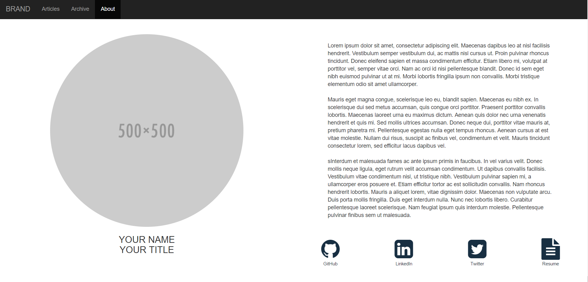
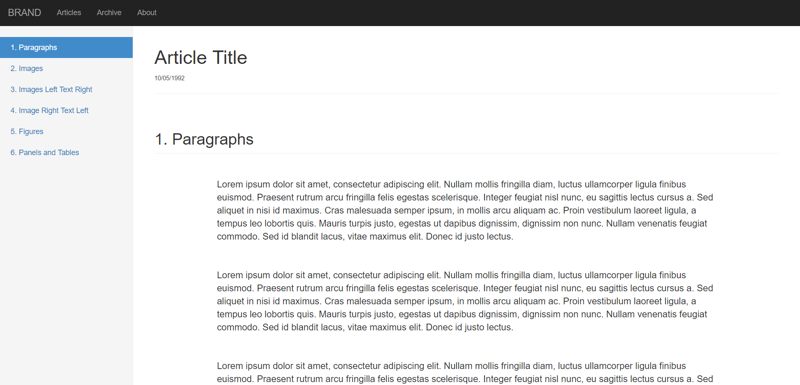
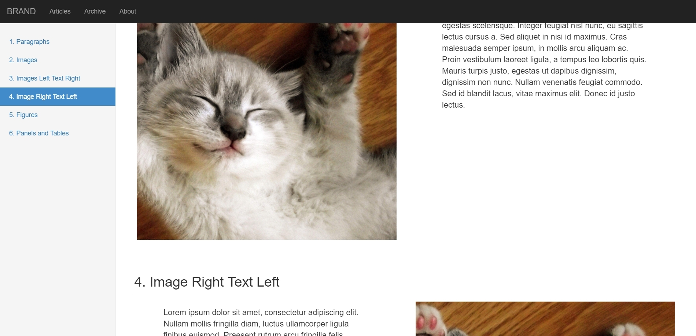
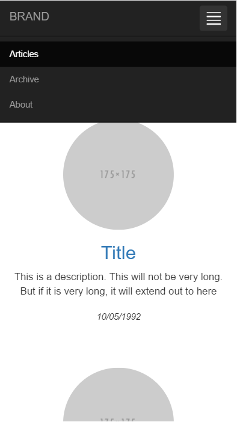
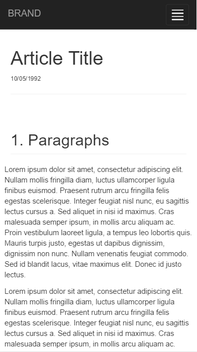
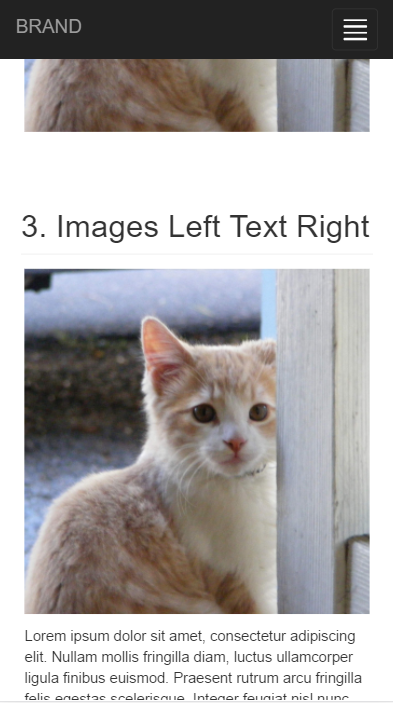

# Template for a Personal Website
This is the template I created for my personal website, see [ryanwhitell.com](http://www.ryanwhitell.com) for an example.

It uses [Bootstrap](http://getbootstrap.com/) as well as some custom JavaScript to handle the side navigation on the article pages. Also [Grunt](https://gruntjs.com/) is in there to help out.

  